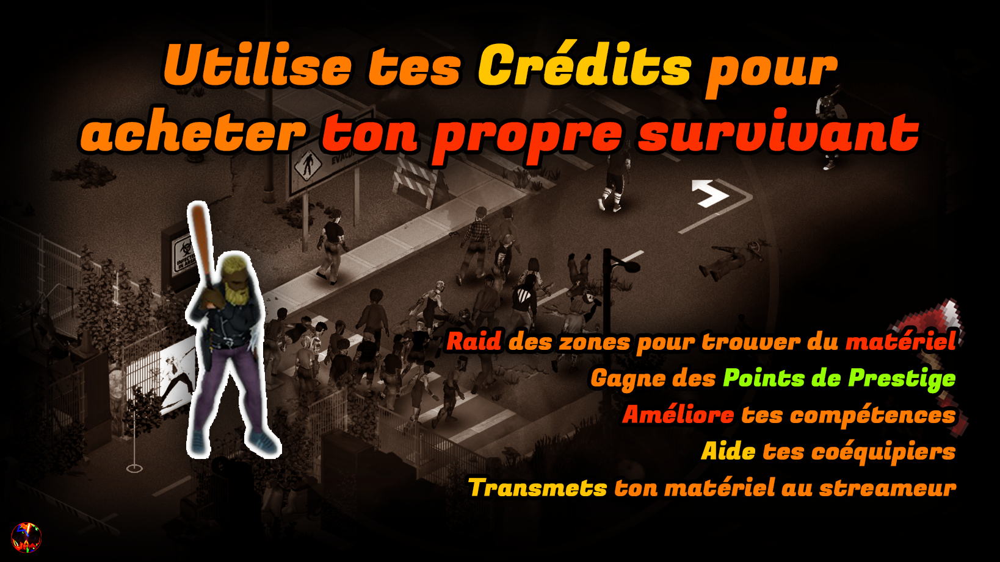

# MOD TWITCH SURVIVORS

Ce mod est un projet réalisé par :

- @Tancred Terror
- @ToF
- @Masoht_7
  et n'aurait jamais pu voir le jour sans l'aide inestimable de ces personnes.

Il permet aux viewers Twitch d'interagir avec une partie Project Zomboid de leur streamer préféré pour prendre le contrôle d'un personnage survivant.
Le mod utilise des points de chaine Twitch, affiche un overlay visible sur le stream Twitch et interagit en temps réel avec le jeu et le personnage du streamer.
Si l'overlay du mod n'est pas affichée sur le stream, c'est que le mod n'est pas encore disponible (activation de la part du streamer pendant une partie).

Vous trouverez ci-dessous toutes les explications pour jouer avec ce mod sur la chaine de TancredTerror notament, premier hebergeur du Twitch survivor.

Si vous avez des questions ou des problèmes à remonter, n'hésitez pas à ouvrir un ticket sur le Github du projet.

  Utilise les récompenses POINTS DE CHAINE du stream pour acheter des CREDITS :
         -> 1 POINT DE CHAINE = 1 CREDIT <-

  Si tu possèdes 2000 CREDITS et que tu n'as pas ton survivant, le mod te générera automatiquement un survivant.

   Sinon, tu peux forcer l'achat de ton survivant avec la commande !create_survivor.

   Créer un survivant coûte 2000 CREDITS

   Le mod n'est fonctionnel que lorsque le streameur l'aura déclenché manuellement, souvent après avoir trouvé une base appropriée pour accueillir d'autres survivants.

   Il ne s'agit pas d'un mod multijoueur : à travers le chat twitch, les viewers peuvent entrer des commandes pour interagir avec leur personnage mais il ne s'agit pas d'un PNJ in-game.

   Plus tu as de crédits, plus tu pourras réaliser d'actions et être performant !

   Le mod sera souvent mis à jour et corrigé : ne convertis tes points de chaine en crédit qu'en fonction de ta consommation, sous peine de peut être perdre des points de chaine si le système du mod venait à être modifié.

