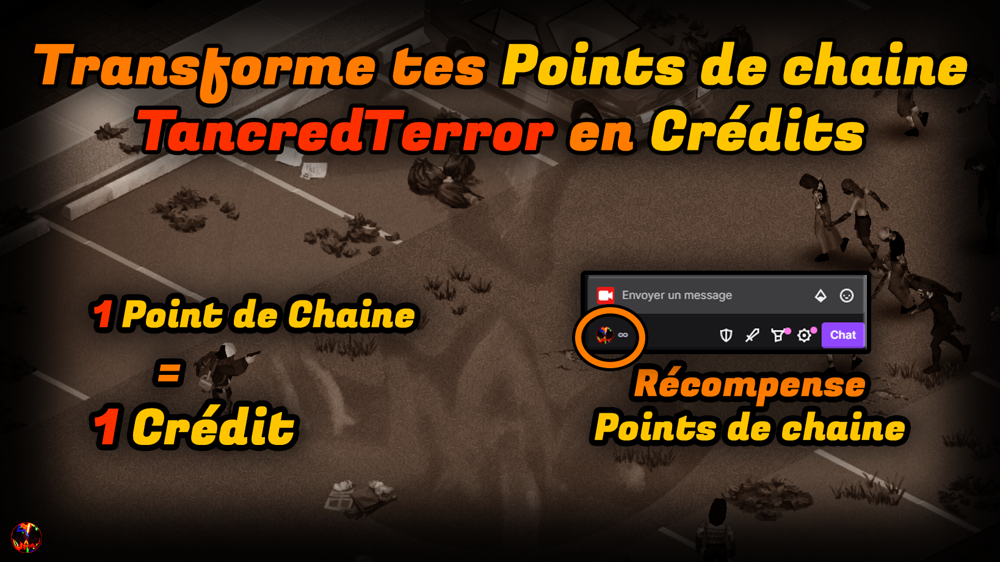
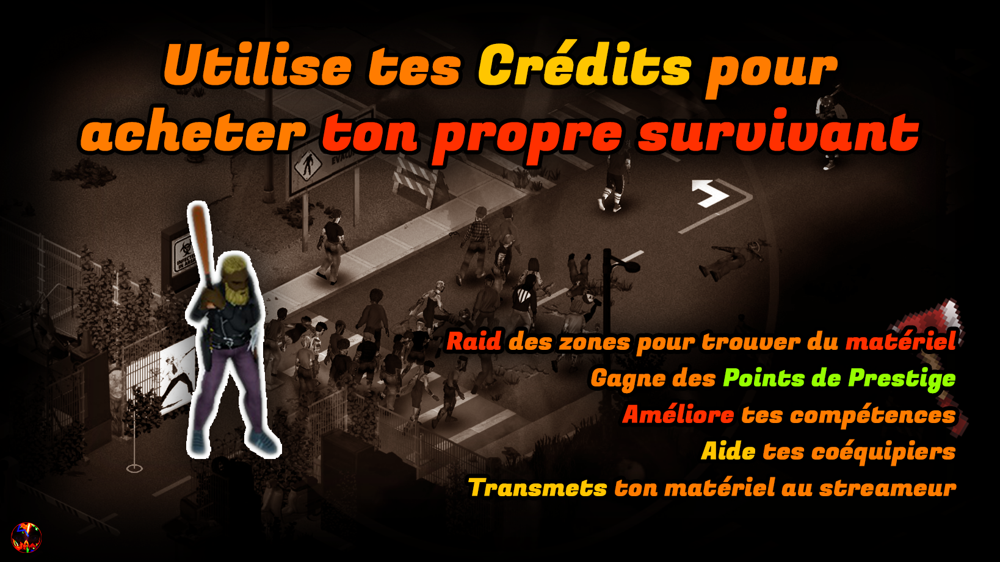
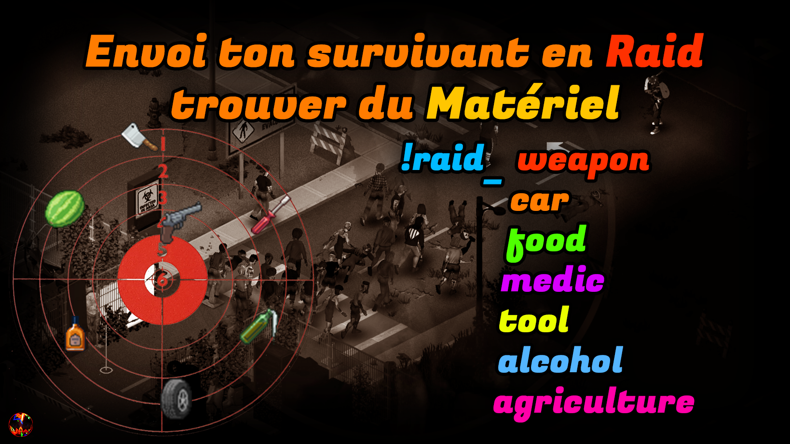
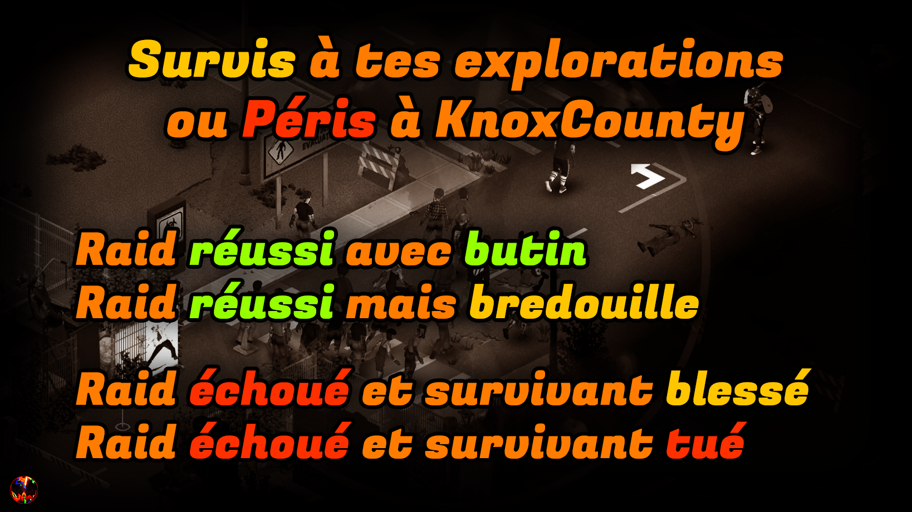
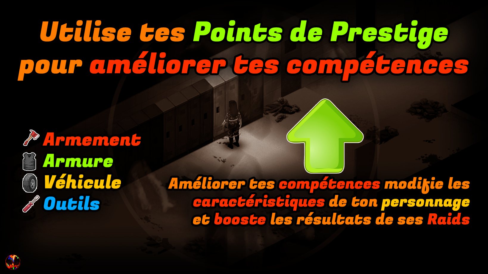
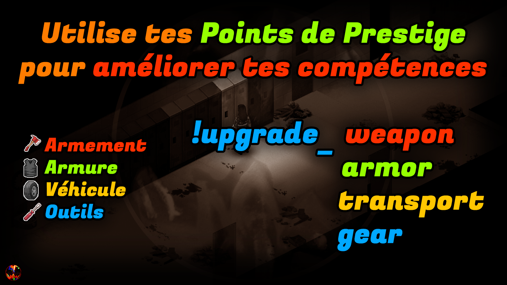
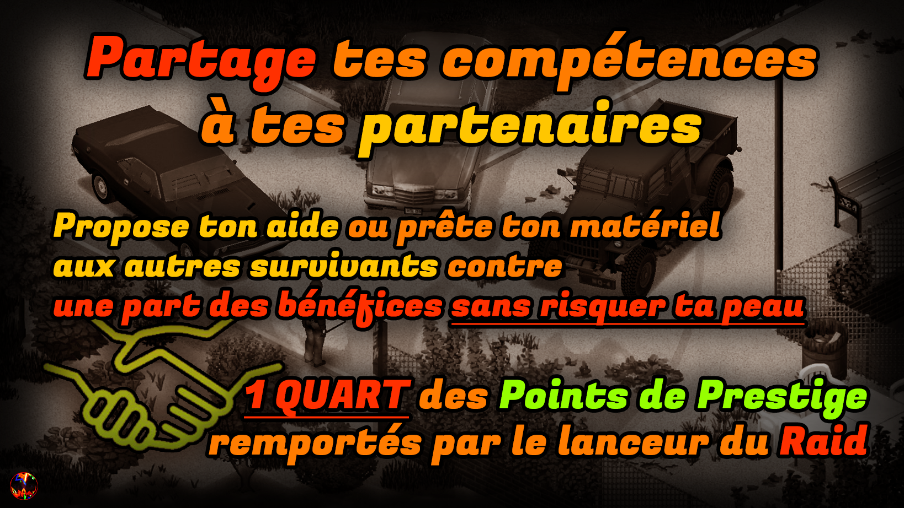
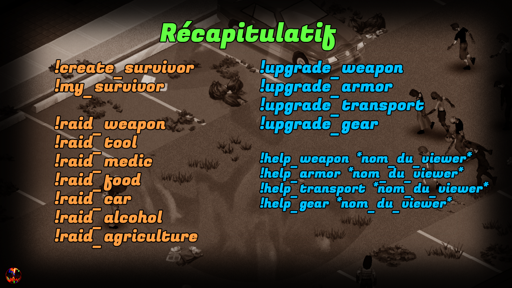

# MOD TWITCH SURVIVORS

Ce mod est un projet réalisé par :

- @Tancred Terror
- @ToF
- @Masoht_7
  et n'aurait jamais pu voir le jour sans l'aide inestimable de ces personnes.

Il permet aux viewers Twitch d'interagir avec une partie Project Zomboid de leur streamer préféré pour prendre le contrôle d'un personnage survivant.
Le mod utilise des points de chaine Twitch, affiche un overlay visible sur le stream Twitch et interagit en temps réel avec le jeu et le personnage du streamer.
Si l'overlay du mod n'est pas affichée sur le stream, c'est que le mod n'est pas encore disponible (activation de la part du streamer pendant une partie).

Vous trouverez ci-dessous toutes les explications pour jouer avec ce mod sur la chaine de TancredTerror notament, premier hebergeur du Twitch survivor.

Si vous avez des questions ou des problèmes à remonter, n'hésitez pas à ouvrir un ticket sur le Github du projet.

 :💶: Utilise les récompenses POINTS DE CHAINE du stream pour acheter des CREDITS :
         -> 1 POINT DE CHAINE = 1 CREDIT <-

 :🧔‍♂️: Si tu possèdes 2000 CREDITS et que tu n'as pas ton survivant, le mod te générera automatiquement un survivant.

 :💪:  Sinon, tu peux forcer l'achat de ton survivant avec la commande !create_survivor.

:⭐:   Créer un survivant coûte 2000 CREDITS

 :🛠️:  Le mod n'est fonctionnel que lorsque le streameur l'aura déclenché manuellement, souvent après avoir trouvé une base appropriée pour accueillir d'autres survivants.

:⚔️:   Il ne s'agit pas d'un mod multijoueur : à travers le chat twitch, les viewers peuvent entrer des commandes pour interagir avec leur personnage mais il ne s'agit pas d'un PNJ in-game.

 :🎸:  Plus tu as de crédits, plus tu pourras réaliser d'actions et être performant !

  :💵: Le mod sera souvent mis à jour et corrigé : ne convertis tes points de chaine en crédit qu'en fonction de ta consommation, sous peine de peut être perdre des points de chaine si le système du mod venait à être modifié.

:🪓:  Envoyer ton survivant en **RAID** dans le monde de Project Zomboid pour trouver des ressources, armes et outils.

:💰:   Si tu réussis à ramener du  **MATERIEL** , le personnage du streamer y aura accès.

:⚔️:   Tu as la possibilité d'utiliser l'une des commandes suivantes :

:🔫: **!raid_weapon**

    *1200 crédits*
Le Raid sera concentré sur la récupération d'armes de corps à corps et d'armes à feu.
Ton survivant pourra également trouver tout les éléments liés aux armes à feu (chargeurs, munitions etc...).

:🪓: **!raid_tool**

    *1000 crédits*
Le Raid sera concentré sur la récupération d'outils (haches, marteaux, masses, tourne-vis etc...).

:☣️: **!raid_medic**

    *800 crédits*
Le Raid sera concentré sur les provisions de soin (bandages, antibiotiques, somnifères etc...).

:🍖: **!raid_food**

* 600 crédits*

Le Raid sera concentré sur la nourriture et les rations de survie (conserves, boissons, riz etc...).

:🚙: **!raid_car**

    *500 crédits*
Le Raid sera concentré sur les composants de mécanique automobile (cric, chargeur de batterie, freins etc...).

:🍹: **!raid_alcohol**

    *400 crédits*
Le Raid sera concentré sur les boissons alcoolisées et consommation notoires (whisky, vin, bières, cigarettes etc...).

:🌿: **!raid_agriculture**

    *300 crédits*
Le Raid sera concentré sur les composants d'agriculture (graines, engrais, pulvérisateur etc...).

:⚠️:  **REUSSIR** tes **RAIDS** augmente tes **POINTS DE PRESTIGE** au sein du groupe de survivants et te permet d'acquérir des  **UPGRADES** .

:⭐:  Le résultat du **RAID** modifie la quantité de **POINTS DE PRESTIGE** gagnés :

:💰:  **RAID réussi avec butin **

    *prestige = coût du raid X2 **+ items découverts***
Le **RAID** s'est bien déroulé et ton survivant a réussi à ramener du matériel à la base.
-------------------------------------------------------------------------------------------

:👝: **RAID réussi bredouille **

    *prestige = coût du raid X1*
Le **RAID** n'a pas connu de complications mais aucun matériel n'a été trouvé à l'endroit escompté.
-----------------------------------------------------------------------------------------------------

:🩸: **RAID échoué blessé  **

    *prestige = coût du raid X0,5*
Le **RAID** ne s'est pas bien déroulé mais ton survivant a réussi à se sortir d'une mauvaise situation. Il retourne à la base sans butin.
------------------------------------------------------------------------------------------------------------------------------------------

:💀: RAID échoué tué **

:💶:   Un **RAID** te fait gagner des **POINTS DE PRESTIGE** qui sont un multiple des crédits dépensés.

Les **objets** que tu trouves avec un **Raid réussi avec butin** te donnent également du **PRESTIGE** supplémentaire !

**Par exemple :**
*tu souhaites réaliser un Raid sur des** Outils**
tu payes **1000 CREDITS** et le Raid démarre
le Raid réussit avec succès et tu trouves un marteau, tu obtiens donc 1000 **X2** + marteau (200, valeur aléatoire pour l'exemple) = 2200 POINTS DE PRESTIGE*

:💀:   Cependant, garde en tête que plus le **RAID** est couteux en  **CREDITS** , plus il est **dangereux** à réaliser.

:💵:  Utilise tes **POINTS DE PRESTIGE** pour améliorer l'équipement de ton personnage et ainsi augmenter tes résultats lors des **RAIDS**

Les compétences du personnage commencent au** Niveau :1️⃣: **

:⬆️:  **Améliorer une compétence au Niveau :2️⃣:  ** = 1000 POINTS DE PRESTIGE

:⏫:  **Améliorer une compétence au Niveau :3️⃣:  ** = 2500 POINTS DE PRESTIGE

:🔥:  **Améliorer une compétence au Niveau :4️⃣:  ** = 6000 POINTS DE PRESTIGE

:⭐:  **Améliorer une compétence au Niveau :5️⃣:  ** = 13000 POINTS DE PRESTIGE

:⚠️: Une seule compétence maximum peut être améliorée au niveau 5 :⚠️:

🪓 **!upgrade_weapon**

    + chance réussir avec butin
    + chance de ramener du butin de meilleur qualité
     - chance échouer avec blessure
Augmente tes chances de te frayer un chemin vers l'objectif et donc de trouver du meilleur butin.

🪖 **!upgrade_armor**

    + chance revenir bredouille
    -  chance échouer tué
Augmente ta défense et ton armure pour survivre aux pires dangers de Knox County.*PS : il n'est pas possible d'éviter à 100% la mort :💀: même avec toutes les upgrades*

🚙 **!upgrade_transport**
    -15 minutes sur la durée du Raid
Augmente ta vitesse pour te déplacer jusqu'à ton objectif et en revenir

🛠️ **!upgrade_gear
    66% de chance de ramener un objet supplémentaire**
Augmente ta capacité de transport pour ramener davantage de butin au cours d'un même Raid.

Pour chaque upgrade un objet supplémentaire peut être ramené (total donc de 5 objets possible avec l'upgrade 5).

*Note : les objets supplémentaires ont de moins en moins de chance d'appartenir à un tier élevé*

💪   Lorsqu'un survivant lance son propre  **RAID** , les autres survivants peuvent l'aider en lui apportant leur expertise dans une seule compétence de leur choix.

💵   Soutenir un **RAID** coûte **1/4** des **CREDITS** que le lanceur de **RAID** a payé.

⭐   Les assistants gagnent une récompense si le lanceur de **RAID** gagne des **POINTS DE PRESTIGE** : c'est une récompense supplémentaire qui ne modifie pas le butin du survivant qui  lançe le  **RAID** .

💰   Chaque assistant gagnera **1/4** des **POINTS DE PRESTIGE** remportés par le lanceur de  **RAID** .

💀  Les assistants ne peuvent pas obtenir de blessure ou de perte en aidant un lanceur de  **RAID** .

🔥  Plusieurs assistants peuvent aider le lanceur de **RAID** dans une même compétence.

⏰  L'assistance doit être apportée  **DANS LES 5 PREMIERES MINUTES DU RAID** .

⏱️  Un assistant devient incapable de lancer un **RAID** ou d'aider un autre survivant tant que le **RAID** auquel il participe est en cours.

🪓 **!help_weapon** *nom_du_viewer*

Tu as décidé de collectionner bon nombre d'armes pour le jour J : applique ton bonus **upgrade_weapons** à sa mission actuelle.

🪖 **!help_armor** *nom_du_viewer*
Tu stockes des tonnes de blousons en cuir, rembourrés et solides : applique ton bonus **upgrade_armor** à sa mission actuelle.

🚙 **!help_transport** *nom_du_viewer*
Tu as décidé d'investir dans l'entretien de ton véhicule : applique ton bonus **upgrade_transport** à sa mission actuelle

🛠️ **!help_gear** *nom_du_viewer*
Tout le monde vient de demander de l'aide pour bricoler ceci ou cela : applique ton bonus **upgrade_gear** à sa mission actuelle.

🚧🚧🚧🚧🚧🚧🚧🚧🚧🚧🚧🚧🚧🚧🚧🚧🚧🚧🚧🚧🚧🚧🚧🚧🚧🚧🚧🚧🚧🚧🚧🚧🚧🚧🚧

    **D'AUTRES FEATURES SONT EN COURS DE DEVELOPPEMENT**

🚧🚧🚧🚧🚧🚧🚧🚧🚧🚧🚧🚧🚧🚧🚧🚧🚧🚧🚧🚧🚧🚧🚧🚧🚧🚧🚧🚧🚧🚧🚧🚧🚧🚧🚧

### Modifications de la compétence GEAR 😳💪

👌 Si le lanceur de **RAID** est censé mourir lors de sa tentative de **RAID** : un nouveau tirage est réalisé jusqu'à un résultat différent de la mort autant de fois qu'il y a d'assistants au  **RAID** .

La compétence GEAR permet d'améliorer cette capacité selon ces critères :

* GEAR LVL1 (initial) : Etre à plusieurs dans la voiture ne permet pas de relancer le résultat du RAID si mort
* GEAR LVL2 : Etre à plusieurs dans la voiture permet de relancer le RAID si MORT 1 fois MAX
* GEAR LVL3 : Etre à plusieurs dans la voiture permet de relancer le RAID si MORT 2 fois MAX
* GEAR LVL4 : Etre à plusieurs dans la voiture permet de relancer le RAID si MORT 3 fois MAX
* GEAR LVL5 : Etre à plusieurs dans la voiture permet de relancer le RAID si MORT 4 fois MAX

### Commande !top_score

Permet d'afficher les 5 viewers ayant obtenus le plus de prestige sur ce wipe

Ton survivant n'a pas réussi à s'en sortir.

Tu ne peux plus le récupérer mais tu peux de nouveau   **GENERER UN NOUVEAU SURVIVANT ** .
